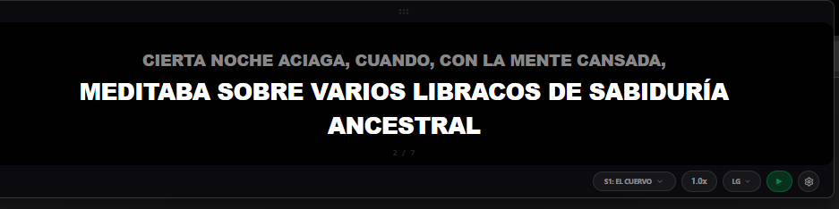
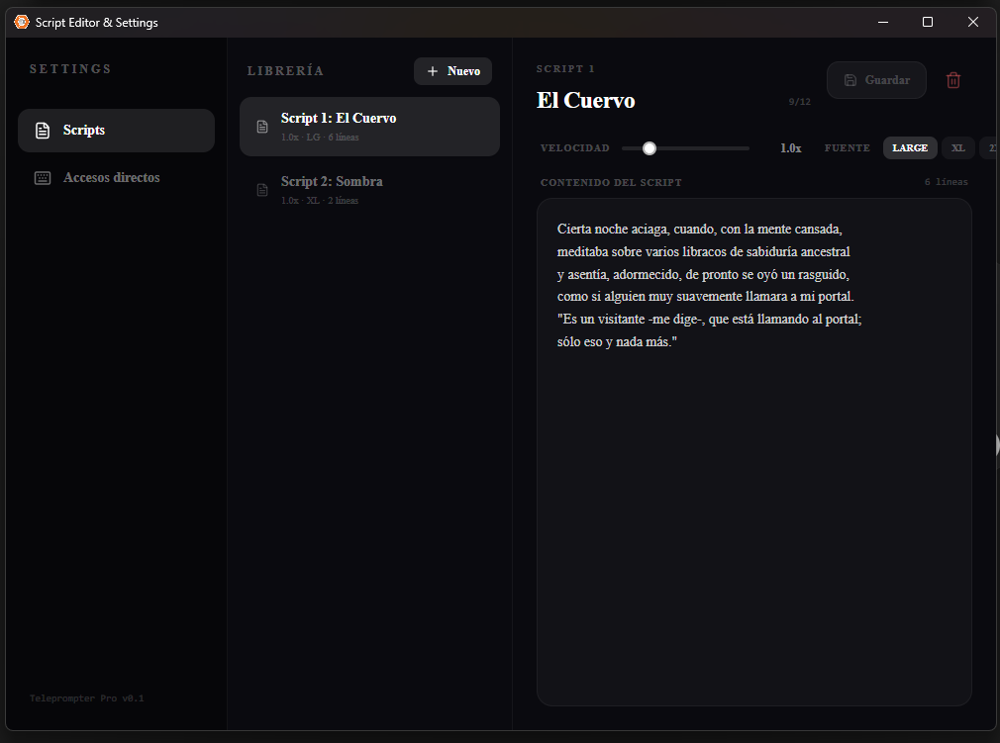
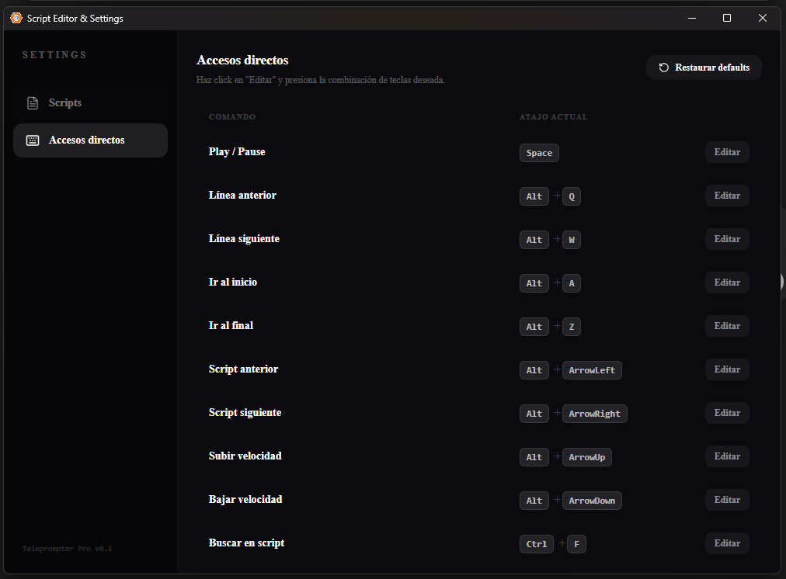

# DPrompter

Un teleprompter simple, creado para uso personal en grabación de videos.

La idea es tener algo minimalista, que funcione bien y sea fácil de usar. Sin features innecesarias ni complejidad.

## Descarga

Podés bajar el ejecutable desde releases:

https://github.com/dgbdevs/DPrompter/releases/tag/DGB

## Compilar

El proyecto está hecho como app de escritorio usando Tauri.

### Requisitos

- Node.js
- Rust
- Tauri CLI

### Pasos

git clone https://github.com/dgbdevs/DPrompter.git
cd DPrompter
npm install
npm run tauri build

## Uso

- Crear o editar scripts desde la app
- Iniciar el teleprompter
- Controlar todo con teclado

### Atajos de teclado

- Play / Pause: Space
- Línea anterior: Alt + Q
- Línea siguiente: Alt + W
- Ir al inicio: Alt + A
- Ir al final: Alt + Z
- Script anterior: Alt + ←
- Script siguiente: Alt + →
- Subir velocidad: Alt + ↑
- Bajar velocidad: Alt + ↓
- Buscar: Ctrl + F

### Notas

- No hay sincronización en la nube
- No hay features “inteligentes”
- Está pensado para ser rápido, directo y sin distracciones

## Licencia
MIT